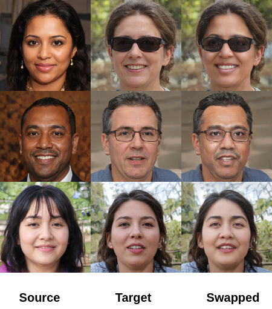

# ExtSwap: Leveraging Extended Latent Mapper for Generating High Quality Face Swapping
# Requriments
    python >=3.6, pytorch==1.5.0 torchvision==0.6.0

# Training
The dataset is comprised of StyleGAN2 generated images and W+ latent codes. see Utils/generate_samples.py.

To train the model run train_script_new.py, you can change parameters in Configs/ folder.

# Results

  <table>
    <tr>
      <td style="text-align:center">
        
         
        <em>Results on our test data</em>
      </td>
      <td style="text-align:center">
        
         
        <em>Comparision with state-of-the-art methods</em>
      </td>
    </tr>
  </table>

  <table>
    <tr>
      <td style="text-align:center">
        
         
        <em>Results on ffhq data</em>
      </td>
      <td style="text-align:center">
        
         
        <em>Results on CelebA-HQ data</em>
      </td>
    </tr>
  </table>

  <table border="1">
    <tr>
      <th colspan="2">FRS</th>
    </tr>
    <tr>
      <td style="text-align:center">ArcFace</td>
      <td style="text-align:center">MagFace</td>
    </tr>
    <tr>
      <th colspan="2">IAPMR</th>
    </tr>
    <tr>
      <td style="text-align:center">86%</td>
      <td style="text-align:center">96%</td>
    </tr>
  </table>
  
<em>Imposter Attack Match Rate (IAPMR) for ArcFace and MagFace based FRS</em>

